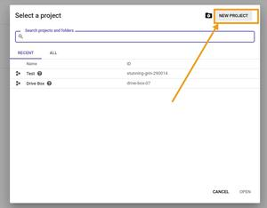
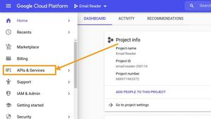
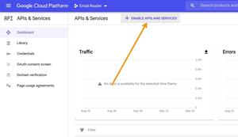
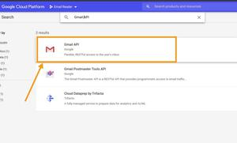
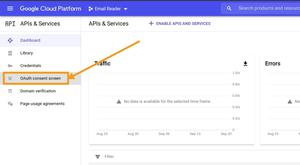
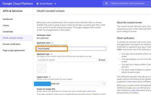
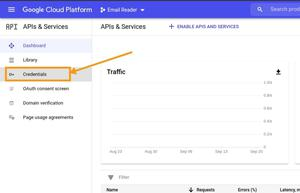
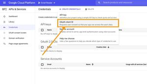

# Gmail Rules Engine

The Gmail Rules Engine is a Python-based application that automates the process of fetching emails from Gmail, storing them in a database, and applying user-defined rules to perform actions on those emails.

## Features

- Fetch emails from Gmail using the Gmail API.
- Store emails in a database for processing.
- Apply rules defined in a JSON file to automate actions on emails.
- Schedule the job to run at regular intervals or execute it once.

## Prerequisites

- Python 3.8 or higher
- Gmail API credentials
- A `.env` file with required environment variables
- PostgresQl database

## Installation

1. Clone the repository:
   ```bash
   git clone git@github.com:akshayanagaraj/Automating-Email-Workflows.git
   cd Automating-Email-Workflow
   ```
2. Create a python virtual env and activate it
   ```bash
   python -m venv env
   source env/bin/activate
   ```
3. Install dependencies:
   ```bash
   pip install -r requirements.txt
   ```

4. Install all packages using poetry
   ```bash
   poetry update
   ```

5. Follow the next steps to create credentials.json file for google access

6. Sign in to Google Cloud console and create a New Project or continue with an existing project.



7. Go to APIs and Services.



8. Enable Gmail API for the selected project.






9. Now, configure the Consent screen by clicking on OAuth Consent Screen if it is not already configured.



10. Enter the Application name and save it.



11. Now go to Credentials.


12. Click on Create credentials, and go to OAuth Client ID.



13. Choose application type as Desktop Application.
14. Enter the Application name, and click on the Create button.
15. The Client ID will be created. Download it to your computer and save it as credentials.json


16. Set up the `.env` file with the following variables:
   ```
   GMAIL_CREDENTIALS_PATH=path/to/credentials.json
   GMAIL_TOKEN_PATH=path/to/token.json
   
   DB_HOST=localhost
   DB_PORT=5432
   DB_NAME=db_name
   DB_USER=user_name
   DB_PASSWORD=password
   ```


## Usage

Run the application with the following command:
```bash
poetry run python -m gmail_rules_engine.main --env-file .env --rules-file rules.json --max-results 100 --interval 5
```

Run with this command to run only once
```bash
poetry run python -m gmail_rules_engine.main --run-once 
```
### Command-Line Arguments

- `--env-file`: Path to the `.env` file (default: `.env`).
- `--rules-file`: Path to the rules JSON file (default: `rules.json`).
- `--max-results`: Maximum number of emails to fetch (default: 100).
- `--interval`: Interval in minutes to run the job (default: 5).
- `--log-level`: Logging level (default: `INFO`).
- `--run-once`: Run the job once and exit.

